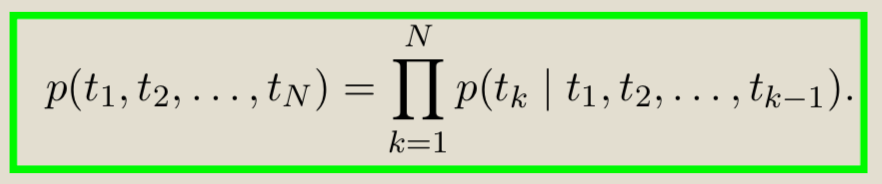
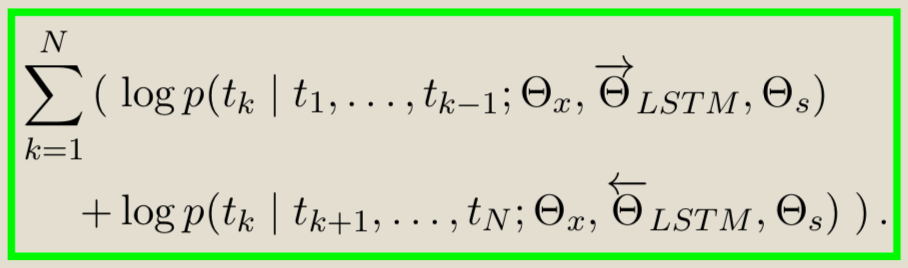
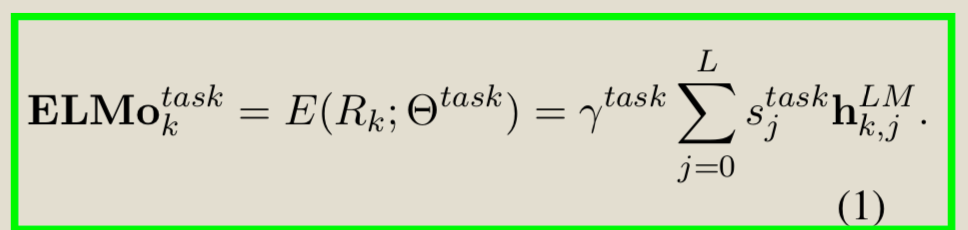
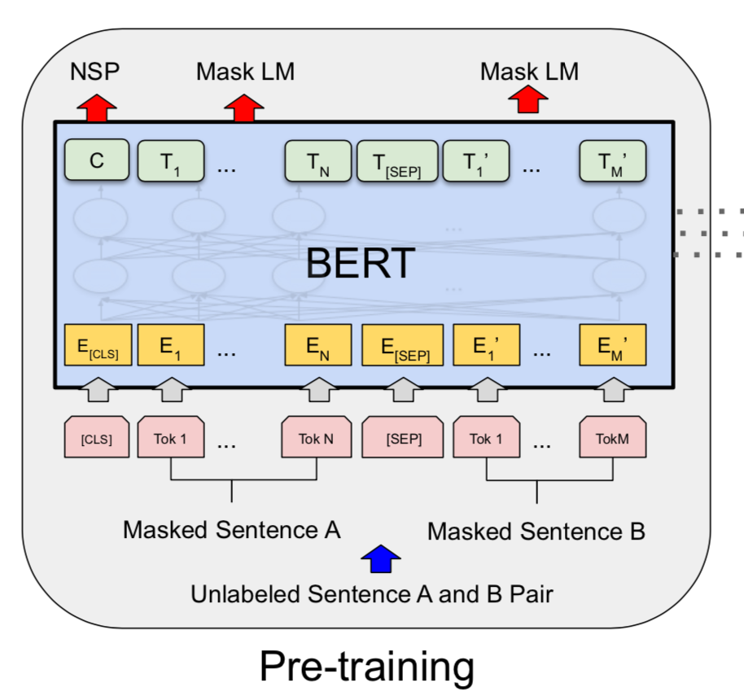

<!-- TOC -->

- [1. Pretrain Language Model](#1-pretrain-language-model)
  - [1.1. 预训练语言模型](#11-%e9%a2%84%e8%ae%ad%e7%bb%83%e8%af%ad%e8%a8%80%e6%a8%a1%e5%9e%8b)
  - [1.2. 相关任务](#12-%e7%9b%b8%e5%85%b3%e4%bb%bb%e5%8a%a1)
    - [1.2.1. NER](#121-ner)
    - [1.2.2. KBQA](#122-kbqa)
  - [1.3. 论文解读](#13-%e8%ae%ba%e6%96%87%e8%a7%a3%e8%af%bb)
    - [1.3.1. ELMo](#131-elmo)
      - [1.3.1.1. 出发点](#1311-%e5%87%ba%e5%8f%91%e7%82%b9)
      - [1.3.1.2. 前言](#1312-%e5%89%8d%e8%a8%80)
      - [1.3.1.3. 模型结构](#1313-%e6%a8%a1%e5%9e%8b%e7%bb%93%e6%9e%84)
      - [1.3.1.4. 使用方法](#1314-%e4%bd%bf%e7%94%a8%e6%96%b9%e6%b3%95)
      - [1.3.1.5. 代码解析(`biLM`)](#1315-%e4%bb%a3%e7%a0%81%e8%a7%a3%e6%9e%90bilm)
    - [1.3.2. BERT](#132-bert)
      - [1.3.2.1. 出发点](#1321-%e5%87%ba%e5%8f%91%e7%82%b9)
      - [1.3.2.2. 前言](#1322-%e5%89%8d%e8%a8%80)
      - [1.3.2.3. 模型结构](#1323-%e6%a8%a1%e5%9e%8b%e7%bb%93%e6%9e%84)
      - [1.3.2.4. 使用方法](#1324-%e4%bd%bf%e7%94%a8%e6%96%b9%e6%b3%95)
      - [1.3.2.5. 代码解析](#1325-%e4%bb%a3%e7%a0%81%e8%a7%a3%e6%9e%90)

<!-- /TOC -->

# 1. Pretrain Language Model

`本项目将追踪最新的预训练语言模型，并进行实际任务的复现和对比。`

## 1.1. 预训练语言模型

- [x] ELMo
- [x] BERT
- [ ] GPT
- [ ] ENRIE
- [ ] RoBERTa
- [ ] Albert
- [ ] XLNet
- [ ] T5
- [ ] ELECTRA

## 1.2. 相关任务

### 1.2.1. NER
- 任务描述
- 数据

### 1.2.2. KBQA
- 任务描述
- 数据

## 1.3. 论文解读

### 1.3.1. ELMo

`Embedding from Language Model`

#### 1.3.1.1. 出发点

> ELMo希望得到这样的词向量：1.具有语义和句法信息，2.具有**上下文信息**。第一点Word2vec和Glove已经解决，ELMo主要解决第二个问题。

#### 1.3.1.2. 前言

`其它关注上下文词向量的工作`

- context2vec
- CoVe

#### 1.3.1.3. 模型结构

- 双向语言模型（`biLM`）

- 训练目标是同时最大化前向和后向极大似然

其中前向概率和后向概率均使用LSTM建模，前向LSTM和后向LSTM不共享参数。

- ELMo

ELMo输出的词向量是biLM中间层隐藏向量的线性组合，加权系数可训练。

其中$h^{LM}_{k,j}是第j层LSTM第k步的隐藏向量，$$s^{task}$是加权向量，$\gamma^{task}$是缩放因子（原文说类似于`layer normalization`）

#### 1.3.1.4. 使用方法

使用无监督语料训练好`biLM`之后，有如下使用方法。其中`biLM`既可以采用固定权重的方式也可以采用`fine-tuning`的方式。

1. 直接和输入的词向量进行拼接：
$$ X --> (X,ELMO(X)) $$

1. 和中间某一层LSTM的输出拼接：
$$ LSTM_{task}(X) --> (LSTM_{task}(X),ELMO(X)) $$

#### 1.3.1.5. 代码解析(`biLM`)

代码链接为：https://github.com/allenai/bilm-tf

### 1.3.2. BERT

`Bidirectional Encoder Representations from Transformers `

#### 1.3.2.1. 出发点
- 深层双向语言模型
- 统一的`fine-tuning`框架

#### 1.3.2.2. 前言
- GPT是单向语言模型，ELMO是LTR和RTL两个单向语言模型。传统语言模型无法使用深层双向模型。
  > **BERT原文**：Unfortunately, standard conditional language models can only be trained left-to-right or right-to-left, since bidirec- tional conditioning would allow each word to in- directly “see itself”, and the model could trivially predict the target word in a multi-layered context.
- ELMO是`feature-based`的思路。
  > `feature-based`式的思路使用预训练模型的输出作为额外特征，需要针对任务设计不同的模型结构。而`fine-tuning`模式则直接在预训练模型的基础上加入简单的输出层一起训练即可。

#### 1.3.2.3. 模型结构

`BERT遵循pre-training和fine-tuning两阶段模式，fine-tuning阶段模型只是在pre-training阶段模型的基础上加入了输出层。`

- 输入
> 为了统一模型结构，对样本对输入进行拼接。如`(A,B)`则处理成`[CLS]+A+[SEP]+B`。同时输入表示由三部分组成：`position embedding`，`segment embedding`和`token embedding`。

- `Mask LM`
> 模型主体为多层双向`Transformer`。不同于传统语言模型的训练模式，BERT将部分`token`替换成`[MASK]`标记，同时预测目标也从`Left-to-Right`或`Right-to-Left`模式的依次预测变成了预测`[MASK]`处的`token`，避免了前文提到的问题。

> `[MASK]`机制也进行了精心设计。由于`fine-tuning`阶段输入没有`[MASK]`标记，为了避免`pre-training`和`fine-tuning`两阶段的不一致性，进行如下`[MASK]`替换：
> - 随机选15%的`token`进行替换
> - 选中的`token`有如下替换模式：80%替换成`[MASK]`标志，10%替换成随机`token`，10%不改变。

- `NSP(Next Sentence Prediction)`
> 许多重要的下游任务如问答和自然语言检索等需要理解两个句子间的关系，而这部分无法通过语言模型刻画。因此BERT设置了NSP的预训练任务，训练样本也很容易从无监督语料中生成。样本生成模式如下：50%是服从前后关系的句子对，50%将后置句子替换成随机句子。

注：`NSP`任务取`[CLS]`标记在最后一层的输出，`Mask LM`取被替换`token`对应位置在最后一层的输出。

#### 1.3.2.4. 使用方法
在`fine-tuning`阶段主要注意数据格式的整理即可。值得注意的有两点：
- 拼接输入对的意义：拼接后`Transformer`会同时建模句子内的上下文信息和句子间的相关信息，和单独建模句子+句子间注意力机制的意义相同。
- `fine-tuning`的时效性：在得到预训练语言模型后，使用fine-tuning来训练下游任务将十分快。

#### 1.3.2.5. 代码解析
- https://github.com/tensorflow/tensor2tensor/blob/master/tensor2tensor/models/transformer.py
- https://github.com/google-research/bert
- https://github.com/codertimo/BERT-pytorch